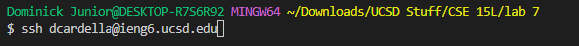
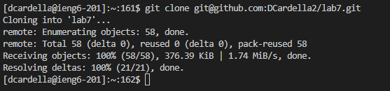
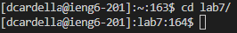
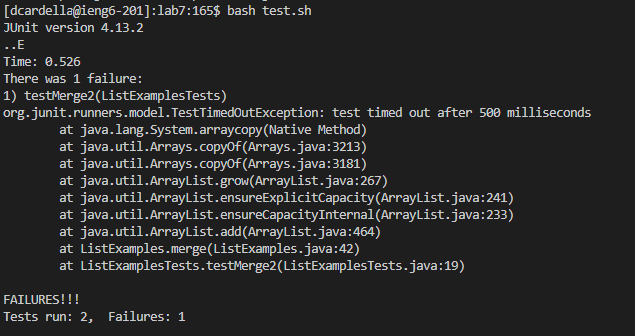
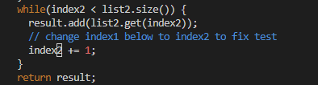
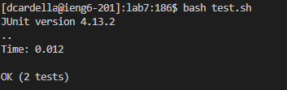
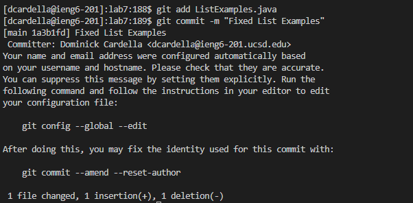
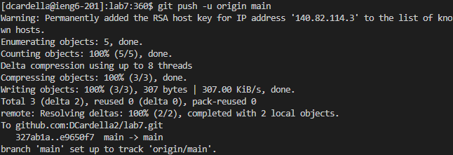

# Lab Report 4

## Doing Tasks From the Command Line

### Logging into a Remote Server using SSH

First, we need to login to ieng6 using ssh. Here, I typed the full command: `ssh dcardella@ieng6.ucsd.edu`. This allowed me to access the terminal in the ieng6 computer.

### Cloning the lab7 repository

Here, I typed the command `git clone <Ctrl+Shift+v>`. Earlier, I copied the SSH-clone URL for the lab7 repository. I was able to paste it here as the URL argument to `git clone`. The result is that I was able to clone the `lab7` repository into the ieng6 workspace.

### Moving to the lab7 directory

After cloning the `lab7` repository, we need to change directory to the `lab7` workspace. Here, I typed `cd l<tab>`. By pressing tab after typing the `l` key, the rest of the `lab7` directory name was autofilled.

### Running the Grading Script

To grade the `ListExamples` file, we need to run a bash script called `test.sh`. Here, I typed `bash t<tab>` to run `test.sh`. By pressing `<tab>` after pressing `t`, the rest of `test.sh` autofilled.

### Opening the ListExamples in Vim

In order to fix the buggy `ListExamples.java` file, we need to open the file using Vim. Here, I typed `vim L<tab>.<tab>`. After typing `L`, I pressed the `<tab>` key, which autofilled to `ListExamples`. However, there were 2 possible files that this matched: `ListExamples.java` and `ListExamplesTests.java`. So, I typed `.` to say that I was reaching the end of the filename. After pressing `<tab>` again, the `.java/` extension was autofilled.

### Fixing the Error in Vim

After opening `ListExamples.java`, we need to edit the file using Vim. Here, I typed `<Shift+g>6ker2:x<enter>`. First, the `<Shift+g>` command allows me to get to the bottom of the file. Then, typing `6k` lets me move up 6 lines. Typing `e` lets me move to the end of the next word, which is `index1`. Then, I typed `r2` to replace the character `1` at the end of `index1` with `2`. Then, I typed `:x<enter>` to save the file and exit Vim. 

### Running the Grading Script Again

We need to run the grading script again to see if the bug is now fixed. Here, I ran `test.sh` similarly to how I did it last time. I typed `bash t<tab>`. By pressing `<tab>` after typing `t`, the rest of `test.sh` was autofilled. 

### Committing the Change to lab7

Next, we need to save our changes to the `lab7` repository. This is done using the `git add` and `git commit` commands.

First, I typed `git add L<tab>`. After typing `L`, the rest of `ListExamples.java/` was autofilled. This let me add the updated `ListExamples.java/` file to the next commit.

Next, I typed the full command `git commit -m "Fixed List Examples"`. This allowed me to save my changes to the `lab7` repository.

### Pushing the Updated lab7 to Github

Next, we need to push our changes to the `lab7` repository to Github. To do this, I typed `git push -u o<tab> m<tab>`. This pushes our updated `main` branch to the `main` branch on Github.
